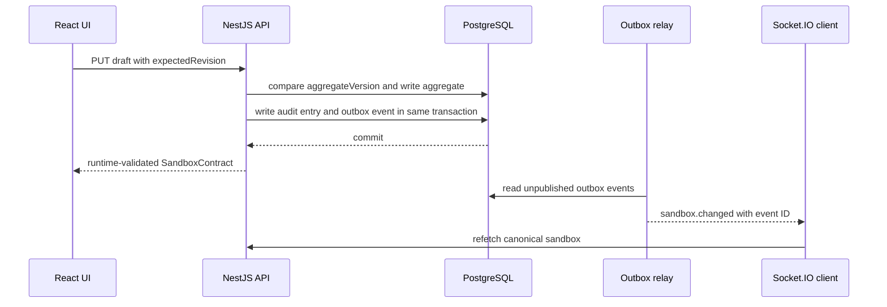

# FlowForm Studio architecture

## Design goal

The application demonstrates a small but complete workflow product whose browser,
API, persistence, event, and object-storage boundaries remain independently
testable. The recruiter sandbox is the aggregate and security boundary for the
current vertical slice.

## State ownership

| State                                                           | Owner                 | Browser behavior                                                |
| --------------------------------------------------------------- | --------------------- | --------------------------------------------------------------- |
| Active role, revision, publication, submission, comments, audit | NestJS and PostgreSQL | TanStack Query caches the parsed API contract                   |
| Editable form and workflow before save                          | Zustand               | A bounded undo and redo history is retained locally             |
| Navigation, theme, selections, draft sync phase                 | Zustand               | Never interpreted as canonical domain state                     |
| Attachment bytes                                                | MinIO                 | The browser keeps only returned attachment metadata and IDs     |
| Durable change notification                                     | PostgreSQL outbox     | Socket.IO causes query invalidation, never blind local mutation |

This division prevents an offline UI transition from pretending that a publication
or approval succeeded. Domain actions render only after the server returns the
updated aggregate.

## Mutation path

The public draft revision protects user-visible editing conflicts. The internal
aggregate version is a compare-and-swap guard for every mutation, including role
changes and workflow actions.

## Persistence modules

`SandboxRepository` is the application-facing port. `PrismaSandboxRepository`
implements durable PostgreSQL transactions. `MemorySandboxRepository` supports
focused tests and an explicit no-database development fallback.

The JSON form, workflow, publication, and submission documents retain their own
schema versions. Audit entries, attachment metadata, and outbox records are
relational rows so they can be queried, delivered, and deleted independently.

## Realtime delivery

The server authenticates the Socket.IO handshake with the sandbox ID and token,
joins a sandbox-specific room, and only then emits `realtime.ready`. Durable events
carry an aggregate version and event ID. The browser deduplicates IDs and invalidates
its canonical query.

With Redis configured, BullMQ retries delivery work. Without Redis, the same outbox
is drained directly for local development. Both modes are at least once. PostgreSQL
state remains authoritative if a socket event is delayed or duplicated.

## Upload path

Multipart input is parsed as a stream. The upload pipeline applies backpressure,
enforces the byte limit while reading, checks PDF, PNG, or JPEG magic bytes, computes
a SHA-256 checksum, and streams to MinIO. If metadata persistence fails, the object
is removed. Sandbox cleanup deletes both database records and the object prefix.

## Failure behavior

- A stale draft revision returns a structured `409` with expected and actual values.
- Concurrent aggregate changes retry from fresh state and eventually return
  `aggregate_busy` rather than overwrite data.
- Invalid API responses fail client-side contract parsing with
  `invalid_api_response`.
- Lost realtime delivery does not lose data because periodic query refresh and the
  next event reload canonical state.
- Production startup fails when private object storage is not configured.
- Readiness checks fail when PostgreSQL or configured MinIO is unavailable.

## Test pyramid

- Package tests validate form rules, workflow transitions, HTTP contracts, and
  realtime schemas.
- Service tests exercise concurrency, workflow actions, and streaming upload edges.
- The NestJS HTTP test covers authentication, request IDs, revision conflict,
  publication, submission, clarification, approval, audit, and realtime delivery.
- Playwright runs the same recruiter journey through Chromium and the live API.
