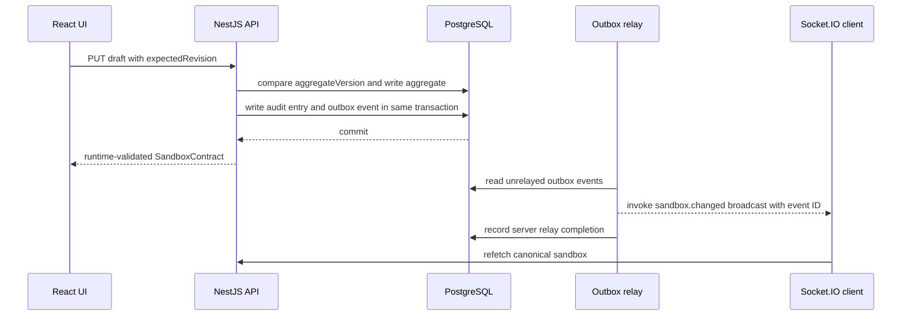

# FlowForm Studio architecture

## Design goal

The application demonstrates a small but complete workflow product whose browser,
API, persistence, event, and object-storage boundaries remain independently
testable. The recruiter sandbox is the aggregate and security boundary for the
current vertical slice.

## State ownership

| State                                                        | Owner                 | Browser behavior                                                |
| ------------------------------------------------------------ | --------------------- | --------------------------------------------------------------- |
| Active role, revision, versions, submission, comments, audit | NestJS and PostgreSQL | TanStack Query caches the parsed API contract                   |
| Editable form and workflow before save                       | Zustand               | A bounded undo and redo history is retained locally             |
| Navigation, theme, selections, draft sync phase              | Zustand               | Never interpreted as canonical domain state                     |
| Attachment bytes                                             | MinIO                 | The browser keeps only returned attachment metadata and IDs     |
| Durable change notification                                  | PostgreSQL outbox     | Socket.IO causes query invalidation, never blind local mutation |

This division prevents an offline UI transition from pretending that a publication
or approval succeeded. Domain actions render only after the server returns the
updated aggregate.

## Mutation path

The public draft revision protects user-visible editing conflicts. The internal
aggregate version is a compare-and-swap guard for every mutation, including role
changes and workflow actions.

## Persistence modules

`SandboxRepository` is the application-facing port. `PrismaSandboxRepository`
implements durable PostgreSQL transactions. `MemorySandboxRepository` supports
focused tests and an explicit no-database development fallback.

The editable form, workflow, and submission remain schema-validated JSON documents.
Every publication is inserted into `PublishedFormVersion` as a separate form and
workflow snapshot under a `(sandboxId, version)` primary key. Audit entries,
attachment metadata, and outbox records are also relational rows so they can be
queried and deleted independently.

Publishing uses the aggregate compare-and-swap transaction. A repeated or concurrent
publish for the already published draft revision returns the current aggregate
without another snapshot, audit row, or outbox event. A submission records its form
version and all later workflow actions resolve that exact snapshot even after a
designer publishes a newer version.

## Realtime delivery

The server authenticates the Socket.IO handshake with the sandbox ID and token,
joins a sandbox-specific room, and only then emits `realtime.ready`. Durable events
carry an aggregate version and event ID. The browser deduplicates IDs and refetches
its canonical query both after a durable event and after every authenticated
connection or reconnection.

With Redis configured, BullMQ retries server relay work. Without Redis, the same
outbox is drained directly for local development. `OutboxEvent.relayedAt` means that
the server invoked the Socket.IO room broadcast. It is not a client acknowledgement
and does not prove that any browser received the notification. Browser delivery is
therefore best effort. PostgreSQL remains authoritative, with reconnect refetches and
30-second polling repairing missed notifications.

## Upload path

Multipart input is parsed as a stream. The upload pipeline applies backpressure,
enforces the byte limit while reading, checks PDF, PNG, or JPEG magic bytes, computes
a SHA-256 checksum, and streams to MinIO. If metadata persistence fails, the object
is removed. Expired cleanup deletes the MinIO prefix first and database metadata
second. A storage failure leaves the already inaccessible expired row in PostgreSQL
so the next cleanup pass can retry without orphaning objects.

## Failure behavior

- A stale draft revision returns a structured `409` with expected and actual values.
- Concurrent aggregate changes retry from fresh state and eventually return
  `aggregate_busy` rather than overwrite data.
- Invalid API responses fail client-side contract parsing with
  `invalid_api_response`.
- Lost browser notifications do not lose data because reconnect and periodic query
  refresh reload canonical state.
- Failed object cleanup retains expired metadata for a later retry.
- Production startup fails when private object storage is not configured.
- Readiness checks fail when PostgreSQL or configured MinIO is unavailable.

## Test pyramid

- Package tests validate form rules, workflow transitions, HTTP contracts, and
  realtime schemas.
- Service tests exercise concurrency, workflow actions, and streaming upload edges.
- The NestJS HTTP test covers authentication, request IDs, revision conflict,
  idempotent publication, version lookup, submission, clarification, approval,
  audit, and realtime relay.
- Playwright runs the same recruiter journey through Chromium and the live API.
